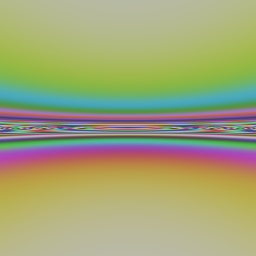
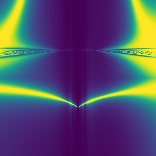

##  Generate Abstract Random Images with Python

When we study image processing or computer vision algorithms, sometimes we may want to test them on unnatural abstarct synthetic images.

This repo shows a way to generate interesting abstract random images in python.

Run the following command line, then you will get 200 color images under ```./color_images_outcome/``` and 200 grayscale images under ```./grayscale_images_outcome/```:
```
python ./generate_abstract_images.py
```
Some interesting images generated are displayed as below.

### Generated Color Images 

     
        
         
         
         
        

### Generated Grayscale Images

      
     
    
    
     
     

Looks not bad, euh?    

**NOTE:  Above are just picked from those 200 images generated with random seed from 0 to 199. To try more different random seeds will surely get many more interesting and appealing images.**    

[Reference1] code adapted from https://www.reedbeta.com/blog/generating-abstract-images-with-random-functions/     
[Reference2] https://gamedev.stackexchange.com/questions/32274/how-can-i-create-beautiful-random-abstract-images

